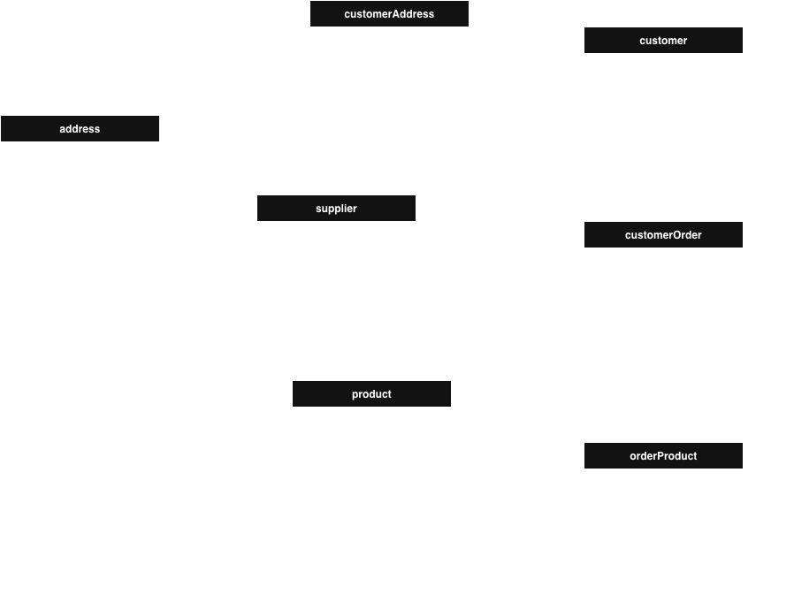

## *Distribución de datos*
_______________________________

📌 Fragmentación vertical
📌 Fragmentación horizontal 


**Instrucciones**. Para estos ejercicios se utiliza la base de datos *salesbd* para construir los fragmentos que se solicitan. 
Utiliza el [respaldo de la base de datos](https://github.com/edcrvl/courses/edit/main/databases/salesBD_bk.sql) para construir los fragmentos.

La práctica se basa en el modelo relacional de la base de datos base de datos *salesbd* que se prenta en el siguiente diagrama. 



Nota. Sigue el ejemplo para preparar tu entregable.

Ejemplo
---------------
0. Proceso para construir el fragmento 1 de la base de datos salesbd.
   
**Esquema del fragmento** ✅


**Script para crear fragmento** ✅

```sql
   SELECT *
     FROM mi_tablas
    WHERE condicion_1
```

**Scripts para descargar los datos de la base de datos salesbd.** 📌

```sql
   SELECT *
     FROM mi_tablas
    WHERE condicion_1
```

**Scripts para cargar los datos al fragmento 1.** 📌

```sql
   INSERT INTO mi_tablas
    FROM origen_1
```


Fragmentos verticales
------------------------
1. 🧠 *Fragmento customerDB*. Construye un fragmento vertical que contenga todos los datos de customer, pero sólo los de customer.
   
**Esquema del fragmento** ✅

	TODO esquema

**Script para crear fragmento** ✅

   TODO script SQL

**Scripts para descargar los datos de la base de datos salesbd.** 📌

   TODO script SQL

**Scripts para cargar los datos al fragmento 1.** 📌

   TODO script SQL

   
2. 🧠 *Fragmento supplierDB*. Construye un fragmento vertical que contenga todos los datos de supplier, pero sólo los de supplier.
   
**Esquema del fragmento** ✅

	TODO esquema

**Script para crear fragmento** ✅

   TODO script SQL

**Scripts para descargar los datos de la base de datos salesbd.** 📌

   TODO script SQL

**Scripts para cargar los datos al fragmento 1.** 📌

   TODO script SQL
   
Fragmentos horizontales
------------------------
3. 🧠 *Fragmento zona1DB*. Construye un fragmento horizontal que contenga todos los clientes con dirección en los estados CDMX e Hidalgo. Incluye toda la información de los clientes y su órdenes de compra.
   
**Esquema del fragmento** ✅

	TODO esquema

**Script para crear fragmento** ✅

   TODO script SQL

**Scripts para descargar los datos de la base de datos salesbd.** 📌

   TODO script SQL

**Scripts para cargar los datos al fragmento 1.** 📌

   TODO script SQL

   
4. 🧠 *Fragmento zona2DB*. Construye un fragmento horizontal que contenga todos los clientes con dirección en los estados estado3 y estado4. Incluye toda la información de los clientes y su órdenes de compra.
   
**Esquema del fragmento** ✅

	TODO esquema

**Script para crear fragmento** ✅

   TODO script SQL

**Scripts para descargar los datos de la base de datos salesbd.** 📌

   TODO script SQL

**Scripts para cargar los datos al fragmento 1.** 📌

   TODO script SQL

5. 🧠 *Fragmento zona3DB*. Construye un fragmento horizontal que contenga todos los clientes con dirección en los estados estado5 y estado6. Incluye toda la información de los clientes y su órdenes de compra.
   
**Esquema del fragmento** ✅

	TODO esquema

**Script para crear fragmento** ✅

   TODO script SQL

**Scripts para descargar los datos de la base de datos salesbd.** 📌

   TODO script SQL

**Scripts para cargar los datos al fragmento 1.** 📌

   TODO script SQL
📘 ¿Qué se refuerza?
✔ Lectura de esquemas
✔ Lógica de negocio
✔ Subconsultas
✔ Consultas tipo examen universitario / técnico

Dime qué quieres, cómo lo quieres y lo armamos 💪 🚀

