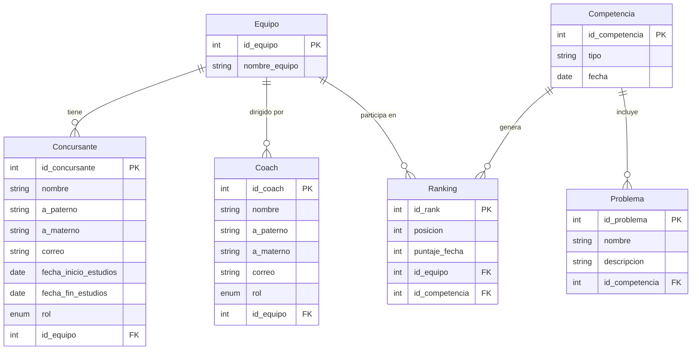

# *Base de Datos Distribuida en Azure - Capa de Software con Python*
_______________________________

📌 **Objetivo.** Implementar una base de datos distribuida en la nube utilizando **Azure Database for MySQL** y desarrollar una capa de software en **Python** con interfaz gráfica que gestione de forma inteligente las operaciones de lectura y escritura, simulando una arquitectura Maestro-Esclavo mediante usuarios con diferentes privilegios.

La información para la *BD* se obtuvo mediante una explicación/plática que se tuvo con el docente simulando un caso real de una consulta para la realización de un *SGBD* donde tomó el rol de un cliente explicando su caso, mientras que nosotros eramos el experto obteniendo información mediante preguntas para poder interpretar lo que él necesita.


Se siguió esta representación para poder realizar todo lo pertinente para la práctica, adaptándola a una arquitectura distribuida en la nube.

_______________________________

# *Modelo Entidad-Relación (MER)*

Una vez analizado e interpretados los *datos*, procedemos a listar los datos para poder realizar un *modelo ER*.



_______________________________
|
# *Configuración de Azure Database for MySQL*

1. Creación de la cuenta y el servidor

Para este proyecto se utilizó Azure Database for MySQL Flexible Server por su facilidad de configuración y su capa gratuita.
    
 Pasos realizados:

-Se creó una cuenta en portal.azure.com con tarjeta de débito para verificación (sin costo inicial).

-En el buscador se escribió: Azure Database for MySQL flexible servers

-Se seleccionó "Creación rápida" (Quick Create) para simplificar el proceso

-Se configuraron los siguientes parámetros:

| Parámetro | Valor asignado |
| --------- | --------- |
| Subscripcción | Azure subscription 1 |
| Grupo de recursos | icpc-mexico2 |
| Nombre del servidor | icpc_mexico |
| Región | West US 2 |
| Versión de MySQL | 8.0 |
| Tipo de carga de trabajo | Desarrollo/Prueba |
| Tamaño de proceso | Burstable B1ms (1 vCore, 2GB RAM) |
| Almacenamiento | 20GB |
| Usuario administrador | islas_vlad |
| Contraseña | ******************* |

-En la pestaña "Networking", se marcó la opción:

      ☑ Agregar regla de firewall para la dirección IP actual
      
-Se hizo clic en "Revisar y crear" y luego en "Crear".

-Se esperó aproximadamente 5-10 minutos hasta que el despliegue finalizó.


2. Obtención de los datos de conexión
   Una vez creado el servidor, se obtuvieron los siguientes datos desde la sección "Overview":

| Dato | Valor |
| --------- | --------- |
| Nombre del servidor | icpc-mexico.mysql.database.azure.com |
| Puerto | 3306 |
| Usuario administrador | islas_vlad |

_______________________________

# *Conexión al servidor desde Azure Query Editor/WorkBench*

 *Opción A: Query Editor (recomendado para empezar)*

  En el menú izquierdo de tu servidor, busca y selecciona "Query editor" (Editor de consultas) 

  Inicia sesión con:
 
      Usuario: islas_vlad

      Contraseña: (la que creaste)

  Una vez dentro, puedes escribir y ejecutar comandos SQL directamente

*Opción B: MySQL Workbench (desde tu computadora)*

  Si prefieres usar MySQL Workbench:

  Abre MySQL Workbench

  Crea una nueva conexión con:

    Hostname: icpc-mexico.mysql.database.azure.com

    Port: 3306

    Username: islas_vlad

    Password: (tu contraseña) 


_______________________________

# *Creación de la base de datos*

1. Una vez dentro, procedemos a crear nuestra *base de datos*.
   ```sql
   mysql> CREATE DATABASE icpc_mexico;
   ```
   
3. Usamos la *base de datos* ya creada.
   ```sql
   mysql> USE icpc_mexico;
   ```

4. Ya en la *base de datos*, ingresamos las sentencias *SQL* para crear las tablas.
   ```sql
       mysql>
             CREATE TABLE Equipo (
             id_equipo      INT NOT NULL AUTO_INCREMENT,
             nombre_equipo  VARCHAR(100) NOT NULL,
             PRIMARY KEY (id_equipo)
             );


             CREATE TABLE Coach (
             id_coach       INT NOT NULL AUTO_INCREMENT,
             nombre         VARCHAR(100) NOT NULL,
             a_paterno      VARCHAR(100) NOT NULL,
             a_materno      VARCHAR(100) NULL,
             correo         VARCHAR(100) NOT NULL,
             id_equipo      INT NOT NULL,
             rol            ENUM('coach', 'cocoach') DEFAULT 'cocoach',
             PRIMARY KEY (id_coach),
             FOREIGN KEY (id_equipo) REFERENCES Equipo(id_equipo)
             );


             CREATE TABLE Concursante (
             id_concursante         INT NOT NULL AUTO_INCREMENT,
             nombre                 VARCHAR(100) NOT NULL,
             a_paterno              VARCHAR(100) NOT NULL,
             a_materno              VARCHAR(100) NULL,
             correo                 VARCHAR(100) NOT NULL,
             fecha_inicio_estudios  DATE NOT NULL,
             fecha_fin_estudios     DATE NOT NULL,
             id_equipo              INT NOT NULL,
             rol                    ENUM('titular', 'suplente') DEFAULT 'titular',
             PRIMARY KEY (id_concursante),
             FOREIGN KEY (id_equipo) REFERENCES Equipo(id_equipo)
             );


             CREATE TABLE Competencia (
             id_competencia  INT NOT NULL AUTO_INCREMENT,
             tipo            VARCHAR(50) NOT NULL,
             fecha           DATE NOT NULL,
             PRIMARY KEY (id_competencia)
             );


             CREATE TABLE Problema (
             id_problema     INT NOT NULL AUTO_INCREMENT,
             nombre          VARCHAR(100),
             descripcion     TEXT NOT NULL,
             id_competencia  INT NOT NULL,
             PRIMARY KEY (id_problema),
             FOREIGN KEY (id_competencia) REFERENCES Competencia(id_competencia)
             );


            CREATE TABLE Ranking (
            id_rank         INT NOT NULL AUTO_INCREMENT,
            posicion        INT NOT NULL,
            puntaje_fecha   INT NOT NULL,
            id_equipo       INT NOT NULL,
            id_competencia  INT NOT NULL,
             PRIMARY KEY (id_rank),
            FOREIGN KEY (id_equipo) REFERENCES Equipo(id_equipo),
            FOREIGN KEY (id_competencia) REFERENCES Competencia(id_competencia)
            );

   ```

5. Con las tablas ya en nuestra *base de datos*, podemos proceder a poblarla.
   ```sql
       mysql>
              INSERT INTO Equipo (nombre_equipo) VALUES ('Prófugos del Citis'), ('Guerreros Digitales');

                INSERT INTO Coach (nombre, a_paterno, a_materno, correo, id_equipo, rol) VALUES
                ('Ana', 'García', 'López', 'ana@mail.com', 1, 'head'),
                ('Carlos', 'Ramírez', NULL, 'carlos@mail.com', 1, 'assistant'),
                ('Luis', 'Fernández', 'Mendoza', 'luis@mail.com', 2, 'head');

   INSERT INTO Concursante (nombre, a_paterno, a_materno, correo, fecha_inicio_estudios, fecha_fin_estudios, id_equipo, rol) VALUES
                ('Juan', 'Pérez', 'Gómez', 'juan@mail.com', '2023-01-15', '2024-12-15', 1, 'titular'),
                ('María', 'López', 'Ruiz', 'maria@mail.com', '2023-01-15', '2024-12-15', 1, 'titular'),
                ('Pedro', 'Sánchez', NULL, 'pedro@mail.com', '2023-06-01', '2025-06-01', 1, 'suplente'),
                ('Laura', 'Martínez', 'Flores', 'laura@mail.com', '2023-02-10', '2024-11-30', 2, 'titular');

               INSERT INTO Competencia (tipo, fecha) VALUES
                ('Repechaje', '2024-03-10'),
                ('Fecha 0', '2024-04-15');

               INSERT INTO Problema (nombre, descripcion, id_competencia) VALUES
                ('A', 'Ordenamiento de burbuja', 1),
                ('B', 'Árbol binario', 1);

               INSERT INTO Ranking (posicion, puntaje_fecha, id_equipo, id_competencia) VALUES
                (1, 100, 1, 1),
                (2, 85, 2, 1);
   
   ```


_______________________________

# *Configuración de Usuarios y Permisos*


Para simular una arquitectura distribuida con Maestro (escrituras) y Esclavo (solo lectura), se crearon dos usuarios con diferentes privilegios dentro del mismo servidor de Azure.

*1. Usuario existente (Maestro)*
El usuario islas_vlad creado al configurar el servidor ya tiene todos los permisos sobre todas las bases de datos.

*2. Creación del usuario Esclavo (solo lectura)*
Desde el Query Editor de Azure o MySQL Workbench, se ejecutaron los siguientes comandos:

   ```sql
        mysql>
            -- Crear el usuario de solo lectura
            CREATE USER 'lectura'@'%' IDENTIFIED BY 'ContraseñaSegura123';

            -- Otorgar solo permiso de SELECT sobre la base de datos
            GRANT SELECT ON competencias_db.* TO 'lectura'@'%';

            -- Aplicar los cambios de privilegios
            FLUSH PRIVILEGES;
   
   ```

*3. Verificación de permisos*
Para comprobar que el usuario lectura solo puede leer, se realizaron las siguientes pruebas:

```sql
        mysql>
            -- Conectar como usuario 'lectura'

            -- Esto funciona (SELECT permitido)
            SELECT * FROM Equipo;

            -- Esto da ERROR (INSERT denegado)
            INSERT INTO Equipo (nombre_equipo) VALUES ('Equipo Prueba');

            -- Esto da ERROR (UPDATE denegado)
            UPDATE Equipo SET nombre_equipo = 'Nuevo Nombre' WHERE id_equipo = 1;

            -- Esto da ERROR (DELETE denegado)
            DELETE FROM Equipo WHERE id_equipo = 1;
   
   ```

*4. Configuración del firewall para múltiples computadoras
Para permitir que otros dispositivos se conecten al servidor de Azure, se agregaron sus direcciones IP en la sección "Networking" del servidor:

    En el portal de Azure → Servidor icpc-mexico → Networking

    En "Firewall rules" → "+ Add firewall rule"

Se agregó:

    Rule name: laptop-compañero

    Start IP: IP pública de la otra computadora

    End IP: misma IP

Se hizo clic en "Save"


_______________________________

# *Capa de Software*

Se desarrolló una capa de software en Python con interfaz gráfica utilizando Tkinter (incluido por defecto en Python). Esta capa se encarga de enrutar las operaciones según su tipo: escrituras al usuario MASTER y lecturas al usuario SLAVE.

*Instalación de dependencias

    pip install mysql-connector-python


*Archivo config.py

Este archivo contiene los datos de conexión a Azure para ambos usuarios.

```py
        python>
# config.py - Configuración para Azure

CONFIG = {
    # Usuario MASTER (todos los permisos)
    'MASTER': {
        'host': 'icpc-mexico.mysql.database.azure.com',
        'user': 'islas_vlad',
        'password': 'TU_CONTRASEÑA_MAESTRO',
        'database': 'competencias_db'
    },
    # Usuario SLAVE (solo lectura)
    'SLAVE': {
        'host': 'icpc-mexico.mysql.database.azure.com',
        'user': 'lectura',
        'password': 'TU_CONTRASEÑA_LECTURA',
        'database': 'competencias_db'
    }
}
 
   ```

*Archivo db_manager.py

Esta clase maneja la conexión a ambos usuarios y enruta las consultas según su tipo.

```py
        python>
import mysql.connector
from mysql.connector import Error
from config import CONFIG
import time

class DBManager:
    def __init__(self):
        self.master_conn = None
        self.slave_conn = None
        self.connect()
    
    def connect(self):
        """Conectar a ambos usuarios"""
        try:
            self.master_conn = mysql.connector.connect(**CONFIG['MASTER'])
            self.slave_conn = mysql.connector.connect(**CONFIG['SLAVE'])
            return True
        except Error as e:
            print(f"Error de conexión: {e}")
            return False
    
    def execute_write(self, query, params=None):
        """Ejecutar escrituras (INSERT, UPDATE, DELETE) usando MASTER"""
        if not self.master_conn or not self.master_conn.is_connected():
            return False, "No hay conexión al maestro"
        
        cursor = self.master_conn.cursor()
        try:
            if params:
                cursor.execute(query, params)
            else:
                cursor.execute(query)
            self.master_conn.commit()
            return True, f"Operación exitosa. Filas afectadas: {cursor.rowcount}"
        except Error as e:
            self.master_conn.rollback()
            return False, f"Error: {e}"
        finally:
            cursor.close()
    
    def execute_read(self, query, params=None):
        """Ejecutar lecturas (SELECT) usando SLAVE (solo lectura)"""
        if not self.slave_conn or not self.slave_conn.is_connected():
            return None, "No hay conexión al esclavo"
        
        cursor = self.slave_conn.cursor()
        try:
            time.sleep(0.3)  # Pequeña pausa para permitir replicación
            if params:
                cursor.execute(query, params)
            else:
                cursor.execute(query)
            results = cursor.fetchall()
            columns = [desc[0] for desc in cursor.description] if cursor.description else []
            return results, columns
        except Error as e:
            return None, f"Error: {e}"
        finally:
            cursor.close()
    
    def close(self):
        """Cerrar conexiones"""
        if self.master_conn:
            self.master_conn.close()
        if self.slave_conn:
            self.slave_conn.close()
 
   ```

*Archivo app.py (Interfaz gráfica)

La interfaz gráfica se desarrolló con Tkinter y contiene 5 pestañas:

```py
        python>
import tkinter as tk
from tkinter import ttk, messagebox, simpledialog
from db_manager import DBManager

class App:
    def __init__(self, root):
        self.root = root
        self.root.title("Sistema de Gestión de Competencias - BD Distribuida")
        self.root.geometry("900x600")
        self.root.configure(bg='#f0f0f0')
        
        # Conectar a la base de datos
        self.db = DBManager()
        if not self.db.connect():
            messagebox.showerror("Error", "No se pudo conectar a la base de datos")
            root.destroy()
            return
        
        self.setup_ui()
        self.cargar_datos_iniciales()
    
    def setup_ui(self):
        # Barra de título
        title_frame = tk.Frame(self.root, bg='#2c3e50', height=60)
        title_frame.pack(fill='x')
        title_frame.pack_propagate(False)
        
        tk.Label(title_frame, text="SISTEMA DE GESTIÓN DE COMPETENCIAS", 
                 font=('Arial', 18, 'bold'), bg='#2c3e50', fg='white').pack(pady=15)
        
        # Frame principal con pestañas
        self.notebook = ttk.Notebook(self.root)
        self.notebook.pack(fill='both', expand=True, padx=10, pady=10)
        
        # Crear pestañas
        self.tab_equipos = ttk.Frame(self.notebook)
        self.tab_concursantes = ttk.Frame(self.notebook)
        self.tab_coaches = ttk.Frame(self.notebook)
        self.tab_rankings = ttk.Frame(self.notebook)
        self.tab_agregar = ttk.Frame(self.notebook)
        
        self.notebook.add(self.tab_equipos, text="Equipos")
        self.notebook.add(self.tab_concursantes, text="Concursantes")
        self.notebook.add(self.tab_coaches, text="Coaches")
        self.notebook.add(self.tab_rankings, text="Rankings")
        self.notebook.add(self.tab_agregar, text="Agregar")
        
        # Configurar cada pestaña
        self.setup_tab_equipos()
        self.setup_tab_concursantes()
        self.setup_tab_coaches()
        self.setup_tab_rankings()
        self.setup_tab_agregar()
        
        # Barra de estado
        self.status_bar = tk.Label(self.root, text="Listo | Usuario MASTER: escrituras | Usuario SLAVE: lecturas", 
                                   bd=1, relief='sunken', anchor='w', bg='#ecf0f1')
        self.status_bar.pack(side='bottom', fill='x')
    
    def setup_tab_equipos(self):
        # Frame para lista de equipos
        frame_lista = tk.Frame(self.tab_equipos)
        frame_lista.pack(side='left', fill='both', expand=True, padx=10, pady=10)
        
        tk.Label(frame_lista, text="Lista de Equipos", font=('Arial', 12, 'bold')).pack(anchor='w')
        
        self.tree_equipos = ttk.Treeview(frame_lista, columns=('ID', 'Nombre'), show='headings', height=15)
        self.tree_equipos.heading('ID', text='ID')
        self.tree_equipos.heading('Nombre', text='Nombre del Equipo')
        self.tree_equipos.column('ID', width=50)
        self.tree_equipos.column('Nombre', width=200)
        self.tree_equipos.pack(fill='both', expand=True)
        
        # Frame para acciones
        frame_acciones = tk.Frame(self.tab_equipos)
        frame_acciones.pack(side='right', fill='y', padx=10, pady=10)
        
        tk.Label(frame_acciones, text="Acciones", font=('Arial', 12, 'bold')).pack()
        
        tk.Button(frame_acciones, text="Actualizar", command=self.cargar_equipos, 
                  bg='#3498db', fg='white', padx=20, pady=5).pack(pady=5)
        
        tk.Button(frame_acciones, text="Editar", command=self.editar_equipo, 
                  bg='#f39c12', fg='white', padx=20, pady=5).pack(pady=5)
        
        tk.Button(frame_acciones, text="Eliminar", command=self.eliminar_equipo, 
                  bg='#e74c3c', fg='white', padx=20, pady=5).pack(pady=5)
    
    def setup_tab_concursantes(self):
        frame_lista = tk.Frame(self.tab_concursantes)
        frame_lista.pack(side='left', fill='both', expand=True, padx=10, pady=10)
        
        tk.Label(frame_lista, text="Lista de Concursantes", font=('Arial', 12, 'bold')).pack(anchor='w')
        
        self.tree_concursantes = ttk.Treeview(frame_lista, columns=('ID', 'Nombre', 'Rol', 'Equipo'), 
                                               show='headings', height=15)
        self.tree_concursantes.heading('ID', text='ID')
        self.tree_concursantes.heading('Nombre', text='Nombre Completo')
        self.tree_concursantes.heading('Rol', text='Rol')
        self.tree_concursantes.heading('Equipo', text='ID Equipo')
        self.tree_concursantes.column('ID', width=50)
        self.tree_concursantes.column('Nombre', width=200)
        self.tree_concursantes.column('Rol', width=100)
        self.tree_concursantes.column('Equipo', width=80)
        self.tree_concursantes.pack(fill='both', expand=True)
        
        frame_acciones = tk.Frame(self.tab_concursantes)
        frame_acciones.pack(side='right', fill='y', padx=10, pady=10)
        
        tk.Label(frame_acciones, text="Acciones", font=('Arial', 12, 'bold')).pack()
        
        tk.Button(frame_acciones, text="Actualizar", command=self.cargar_concursantes, 
                  bg='#3498db', fg='white', padx=20, pady=5).pack(pady=5)
        
        tk.Button(frame_acciones, text="Editar", command=self.editar_concursante, 
                  bg='#f39c12', fg='white', padx=20, pady=5).pack(pady=5)
        
        tk.Button(frame_acciones, text="Eliminar", command=self.eliminar_concursante, 
                  bg='#e74c3c', fg='white', padx=20, pady=5).pack(pady=5)
    
    def setup_tab_coaches(self):
        frame_lista = tk.Frame(self.tab_coaches)
        frame_lista.pack(side='left', fill='both', expand=True, padx=10, pady=10)
        
        tk.Label(frame_lista, text="Lista de Coaches", font=('Arial', 12, 'bold')).pack(anchor='w')
        
        self.tree_coaches = ttk.Treeview(frame_lista, columns=('ID', 'Nombre', 'Rol', 'Equipo'), 
                                         show='headings', height=15)
        self.tree_coaches.heading('ID', text='ID')
        self.tree_coaches.heading('Nombre', text='Nombre Completo')
        self.tree_coaches.heading('Rol', text='Rol')
        self.tree_coaches.heading('Equipo', text='ID Equipo')
        self.tree_coaches.column('ID', width=50)
        self.tree_coaches.column('Nombre', width=200)
        self.tree_coaches.column('Rol', width=100)
        self.tree_coaches.column('Equipo', width=80)
        self.tree_coaches.pack(fill='both', expand=True)
        
        frame_acciones = tk.Frame(self.tab_coaches)
        frame_acciones.pack(side='right', fill='y', padx=10, pady=10)
        
        tk.Label(frame_acciones, text="Acciones", font=('Arial', 12, 'bold')).pack()
        
        tk.Button(frame_acciones, text=" Actualizar", command=self.cargar_coaches, 
                  bg='#3498db', fg='white', padx=20, pady=5).pack(pady=5)
        
        tk.Button(frame_acciones, text=" Editar", command=self.editar_coach, 
                  bg='#f39c12', fg='white', padx=20, pady=5).pack(pady=5)
        
        tk.Button(frame_acciones, text=" Eliminar", command=self.eliminar_coach, 
                  bg='#e74c3c', fg='white', padx=20, pady=5).pack(pady=5)
    
    def setup_tab_rankings(self):
        frame_lista = tk.Frame(self.tab_rankings)
        frame_lista.pack(side='left', fill='both', expand=True, padx=10, pady=10)
        
        tk.Label(frame_lista, text="Rankings por Competencia", font=('Arial', 12, 'bold')).pack(anchor='w')
        
        self.tree_rankings = ttk.Treeview(frame_lista, columns=('Posición', 'Puntaje', 'Equipo', 'Competencia'), 
                                          show='headings', height=15)
        self.tree_rankings.heading('Posición', text='Posición')
        self.tree_rankings.heading('Puntaje', text='Puntaje')
        self.tree_rankings.heading('Equipo', text='Equipo')
        self.tree_rankings.heading('Competencia', text='Competencia')
        self.tree_rankings.column('Posición', width=80)
        self.tree_rankings.column('Puntaje', width=80)
        self.tree_rankings.column('Equipo', width=150)
        self.tree_rankings.column('Competencia', width=150)
        self.tree_rankings.pack(fill='both', expand=True)
        
        frame_acciones = tk.Frame(self.tab_rankings)
        frame_acciones.pack(side='right', fill='y', padx=10, pady=10)
        
        tk.Label(frame_acciones, text="Acciones", font=('Arial', 12, 'bold')).pack()
        
        tk.Button(frame_acciones, text="Actualizar", command=self.cargar_rankings, 
                  bg='#3498db', fg='white', padx=20, pady=5).pack(pady=5)
    
    def setup_tab_agregar(self):
        # Frame para formulario de agregar equipo
        frame_equipo = tk.LabelFrame(self.tab_agregar, text="Agregar Nuevo Equipo", padx=10, pady=10)
        frame_equipo.pack(side='left', fill='both', expand=True, padx=10, pady=10)
        
        tk.Label(frame_equipo, text="Nombre del Equipo:").grid(row=0, column=0, sticky='e', pady=5)
        self.entry_nombre_equipo = tk.Entry(frame_equipo, width=30)
        self.entry_nombre_equipo.grid(row=0, column=1, pady=5)
        
        tk.Button(frame_equipo, text="Guardar Equipo", command=self.guardar_equipo, 
                  bg='#27ae60', fg='white', padx=15, pady=5).grid(row=1, column=0, columnspan=2, pady=10)
        
        # Frame para formulario de agregar concursante
        frame_concursante = tk.LabelFrame(self.tab_agregar, text="Agregar Nuevo Concursante", padx=10, pady=10)
        frame_concursante.pack(side='left', fill='both', expand=True, padx=10, pady=10)
        
        campos = ['Nombre:', 'Apellido Paterno:', 'Apellido Materno:', 'Correo:', 
                  'Fecha Inicio (YYYY-MM-DD):', 'Fecha Fin (YYYY-MM-DD):', 'ID Equipo:', 'Rol (titular/suplente):']
        
        self.entries_concursante = []
        for i, campo in enumerate(campos):
            tk.Label(frame_concursante, text=campo).grid(row=i, column=0, sticky='e', pady=3)
            entry = tk.Entry(frame_concursante, width=25)
            entry.grid(row=i, column=1, pady=3)
            self.entries_concursante.append(entry)
        
        tk.Button(frame_concursante, text="Guardar Concursante", command=self.guardar_concursante, 
                  bg='#27ae60', fg='white', padx=15, pady=5).grid(row=len(campos), column=0, columnspan=2, pady=10)
        
        # Frame para formulario de agregar coach
        frame_coach = tk.LabelFrame(self.tab_agregar, text="Agregar Nuevo Coach", padx=10, pady=10)
        frame_coach.pack(side='left', fill='both', expand=True, padx=10, pady=10)
        
        campos_coach = ['Nombre:', 'Apellido Paterno:', 'Apellido Materno:', 'Correo:', 'ID Equipo:', 'Rol (head/assistant):']
        
        self.entries_coach = []
        for i, campo in enumerate(campos_coach):
            tk.Label(frame_coach, text=campo).grid(row=i, column=0, sticky='e', pady=3)
            entry = tk.Entry(frame_coach, width=25)
            entry.grid(row=i, column=1, pady=3)
            self.entries_coach.append(entry)
        
        tk.Button(frame_coach, text="Guardar Coach", command=self.guardar_coach, 
                  bg='#27ae60', fg='white', padx=15, pady=5).grid(row=len(campos_coach), column=0, columnspan=2, pady=10)
    
    def cargar_datos_iniciales(self):
        self.cargar_equipos()
        self.cargar_concursantes()
        self.cargar_coaches()
        self.cargar_rankings()
    
    def cargar_equipos(self):
        # Limpiar la tabla
        try:
            for item in self.tree_equipos.get_children():
                self.tree_equipos.delete(item)
        except:
            pass
        
        resultados, error = self.db.execute_read("SELECT id_equipo, nombre_equipo FROM Equipo")
        if resultados:
            for row in resultados:
                self.tree_equipos.insert('', 'end', values=row)
            self.status_bar.config(text=f"Equipos cargados: {len(resultados)} registros (lectura desde SLAVE)")
        else:
            self.status_bar.config(text="No hay equipos para mostrar o error: " + str(error))
    
    def cargar_concursantes(self):
        # Limpiar la tabla
        try:
            for item in self.tree_concursantes.get_children():
                self.tree_concursantes.delete(item)
        except:
            pass
        
        query = "SELECT id_concursante, CONCAT(nombre, ' ', a_paterno) as nombre, rol, id_equipo FROM Concursante"
        resultados, error = self.db.execute_read(query)
        if resultados:
            for row in resultados:
                self.tree_concursantes.insert('', 'end', values=row)
            self.status_bar.config(text=f"Concursantes cargados: {len(resultados)} registros (lectura desde SLAVE)")
        else:
            self.status_bar.config(text="No hay concursantes para mostrar o error: " + str(error))
    
    def cargar_coaches(self):
        # Limpiar la tabla
        try:
            for item in self.tree_coaches.get_children():
                self.tree_coaches.delete(item)
        except:
            pass
        
        query = "SELECT id_coach, CONCAT(nombre, ' ', a_paterno) as nombre, rol, id_equipo FROM Coach"
        resultados, error = self.db.execute_read(query)
        if resultados:
            for row in resultados:
                self.tree_coaches.insert('', 'end', values=row)
            self.status_bar.config(text=f" Coaches cargados: {len(resultados)} registros (lectura desde SLAVE)")
        else:
            self.status_bar.config(text="No hay coaches para mostrar o error: " + str(error))
    
    def cargar_rankings(self):
        # Limpiar la tabla
        try:
            for item in self.tree_rankings.get_children():
                self.tree_rankings.delete(item)
        except:
            pass
        
        query = """
            SELECT r.posicion, r.puntaje_fecha, e.nombre_equipo, c.tipo 
            FROM Ranking r
            JOIN Equipo e ON r.id_equipo = e.id_equipo
            JOIN Competencia c ON r.id_competencia = c.id_competencia
        """
        resultados, error = self.db.execute_read(query)
        if resultados:
            for row in resultados:
                self.tree_rankings.insert('', 'end', values=row)
            self.status_bar.config(text=f" Rankings cargados: {len(resultados)} registros (lectura desde SLAVE)")
        else:
            self.status_bar.config(text=" No hay rankings para mostrar o error: " + str(error))
    
    def guardar_equipo(self):
        nombre = self.entry_nombre_equipo.get().strip()
        if not nombre:
            messagebox.showwarning("Advertencia", "Ingrese un nombre para el equipo")
            return
        
        success, msg = self.db.execute_write("INSERT INTO Equipo (nombre_equipo) VALUES (%s)", (nombre,))
        if success:
            messagebox.showinfo("Éxito", "Equipo agregado correctamente")
            self.entry_nombre_equipo.delete(0, tk.END)
            self.cargar_equipos()
        else:
            messagebox.showerror("Error", msg)
    
    def guardar_concursante(self):
        valores = [entry.get().strip() for entry in self.entries_concursante]
        if any(not v for v in valores[:3]):
            messagebox.showwarning("Advertencia", "Complete al menos nombre y apellido paterno")
            return
        
        query = """
            INSERT INTO Concursante 
            (nombre, a_paterno, a_materno, correo, fecha_inicio_estudios, fecha_fin_estudios, id_equipo, rol) 
            VALUES (%s, %s, %s, %s, %s, %s, %s, %s)
        """
        success, msg = self.db.execute_write(query, tuple(valores))
        if success:
            messagebox.showinfo("Éxito", "Concursante agregado correctamente")
            for entry in self.entries_concursante:
                entry.delete(0, tk.END)
            self.cargar_concursantes()
        else:
            messagebox.showerror("Error", msg)
    
    def guardar_coach(self):
        valores = [entry.get().strip() for entry in self.entries_coach]
        if any(not v for v in valores[:2]):
            messagebox.showwarning("Advertencia", "Complete al menos nombre y apellido paterno")
            return
        
        query = """
            INSERT INTO Coach (nombre, a_paterno, a_materno, correo, id_equipo, rol) 
            VALUES (%s, %s, %s, %s, %s, %s)
        """
        success, msg = self.db.execute_write(query, tuple(valores))
        if success:
            messagebox.showinfo("Éxito", "Coach agregado correctamente")
            for entry in self.entries_coach:
                entry.delete(0, tk.END)
            self.cargar_coaches()
        else:
            messagebox.showerror("Error", msg)
    
    def editar_equipo(self):
        seleccion = self.tree_equipos.selection()
        if not seleccion:
            messagebox.showwarning("Advertencia", "Seleccione un equipo para editar")
            return
        
        valores = self.tree_equipos.item(seleccion[0])['values']
        id_equipo = valores[0]
        nombre_actual = valores[1]
        
        nuevo_nombre = simpledialog.askstring("Editar Equipo", "Nuevo nombre:", initialvalue=nombre_actual)
        if nuevo_nombre:
            success, msg = self.db.execute_write("UPDATE Equipo SET nombre_equipo = %s WHERE id_equipo = %s", 
                                                  (nuevo_nombre, id_equipo))
            if success:
                messagebox.showinfo("Éxito", "Equipo actualizado")
                self.cargar_equipos()
            else:
                messagebox.showerror("Error", msg)
    
    def eliminar_equipo(self):
        seleccion = self.tree_equipos.selection()
        if not seleccion:
            messagebox.showwarning("Advertencia", "Seleccione un equipo para eliminar")
            return
        
        valores = self.tree_equipos.item(seleccion[0])['values']
        id_equipo = valores[0]
        
        if messagebox.askyesno("Confirmar", f"¿Eliminar el equipo '{valores[1]}'?"):
            success, msg = self.db.execute_write("DELETE FROM Equipo WHERE id_equipo = %s", (id_equipo,))
            if success:
                messagebox.showinfo("Éxito", "Equipo eliminado")
                self.cargar_equipos()
                self.cargar_concursantes()
                self.cargar_coaches()
            else:
                messagebox.showerror("Error", msg)
    
    def editar_concursante(self):
        seleccion = self.tree_concursantes.selection()
        if not seleccion:
            messagebox.showwarning("Advertencia", "Seleccione un concursante para editar")
            return
        
        valores = self.tree_concursantes.item(seleccion[0])['values']
        id_concursante = valores[0]
        nombre_actual = valores[1]
        rol_actual = valores[2]
        id_equipo_actual = valores[3]
        
        # Ventana de edición
        ventana_edicion = tk.Toplevel(self.root)
        ventana_edicion.title("Editar Concursante")
        ventana_edicion.geometry("400x350")
        ventana_edicion.configure(bg='#f0f0f0')
        
        tk.Label(ventana_edicion, text="Editar Concursante", font=('Arial', 14, 'bold'), bg='#f0f0f0').pack(pady=10)
        
        frame_form = tk.Frame(ventana_edicion, bg='#f0f0f0')
        frame_form.pack(pady=10)
        
        tk.Label(frame_form, text="Nombre:", bg='#f0f0f0').grid(row=0, column=0, sticky='e', pady=5, padx=5)
        entry_nombre = tk.Entry(frame_form, width=30)
        entry_nombre.insert(0, nombre_actual.split()[0] if nombre_actual else "")
        entry_nombre.grid(row=0, column=1, pady=5)
        
        tk.Label(frame_form, text="Apellido Paterno:", bg='#f0f0f0').grid(row=1, column=0, sticky='e', pady=5, padx=5)
        entry_a_paterno = tk.Entry(frame_form, width=30)
        partes = nombre_actual.split() if nombre_actual else []
        entry_a_paterno.insert(0, partes[1] if len(partes) > 1 else "")
        entry_a_paterno.grid(row=1, column=1, pady=5)
        
        tk.Label(frame_form, text="Rol (titular/suplente):", bg='#f0f0f0').grid(row=2, column=0, sticky='e', pady=5, padx=5)
        combo_rol = ttk.Combobox(frame_form, values=['titular', 'suplente'], width=27)
        combo_rol.set(rol_actual)
        combo_rol.grid(row=2, column=1, pady=5)
        
        tk.Label(frame_form, text="ID Equipo:", bg='#f0f0f0').grid(row=3, column=0, sticky='e', pady=5, padx=5)
        entry_id_equipo = tk.Entry(frame_form, width=30)
        entry_id_equipo.insert(0, str(id_equipo_actual))
        entry_id_equipo.grid(row=3, column=1, pady=5)
        
        def guardar_cambios():
            nuevo_nombre = entry_nombre.get().strip()
            nuevo_a_paterno = entry_a_paterno.get().strip()
            nuevo_rol = combo_rol.get()
            nuevo_id_equipo = entry_id_equipo.get().strip()
            
            if not nuevo_nombre or not nuevo_a_paterno:
                messagebox.showwarning("Advertencia", "Nombre y apellido son obligatorios")
                return
            
            query = """
                UPDATE Concursante 
                SET nombre = %s, a_paterno = %s, rol = %s, id_equipo = %s 
                WHERE id_concursante = %s
            """
            success, msg = self.db.execute_write(query, (nuevo_nombre, nuevo_a_paterno, nuevo_rol, nuevo_id_equipo, id_concursante))
            if success:
                messagebox.showinfo("Éxito", "Concursante actualizado")
                ventana_edicion.destroy()
                self.cargar_concursantes()
            else:
                messagebox.showerror("Error", msg)
        
        btn_frame = tk.Frame(ventana_edicion, bg='#f0f0f0')
        btn_frame.pack(pady=20)
        
        tk.Button(btn_frame, text=" Guardar Cambios", command=guardar_cambios, 
                  bg='#27ae60', fg='white', padx=15, pady=5).pack(side='left', padx=10)
        
        tk.Button(btn_frame, text=" Cancelar", command=ventana_edicion.destroy, 
                  bg='#95a5a6', fg='white', padx=15, pady=5).pack(side='left', padx=10)
    
    def eliminar_concursante(self):
        seleccion = self.tree_concursantes.selection()
        if not seleccion:
            messagebox.showwarning("Advertencia", "Seleccione un concursante para eliminar")
            return
        
        valores = self.tree_concursantes.item(seleccion[0])['values']
        if messagebox.askyesno("Confirmar", f"¿Eliminar al concursante '{valores[1]}'?"):
            success, msg = self.db.execute_write("DELETE FROM Concursante WHERE id_concursante = %s", (valores[0],))
            if success:
                messagebox.showinfo("Éxito", "Concursante eliminado")
                self.cargar_concursantes()
            else:
                messagebox.showerror("Error", msg)
    
    def editar_coach(self):
        seleccion = self.tree_coaches.selection()
        if not seleccion:
            messagebox.showwarning("Advertencia", "Seleccione un coach para editar")
            return
        
        valores = self.tree_coaches.item(seleccion[0])['values']
        id_coach = valores[0]
        nombre_actual = valores[1]
        rol_actual = valores[2]
        id_equipo_actual = valores[3]
        
        # Ventana de edición
        ventana_edicion = tk.Toplevel(self.root)
        ventana_edicion.title("Editar Coach")
        ventana_edicion.geometry("400x300")
        ventana_edicion.configure(bg='#f0f0f0')
        
        tk.Label(ventana_edicion, text="Editar Coach", font=('Arial', 14, 'bold'), bg='#f0f0f0').pack(pady=10)
        
        frame_form = tk.Frame(ventana_edicion, bg='#f0f0f0')
        frame_form.pack(pady=10)
        
        tk.Label(frame_form, text="Nombre:", bg='#f0f0f0').grid(row=0, column=0, sticky='e', pady=5, padx=5)
        entry_nombre = tk.Entry(frame_form, width=30)
        entry_nombre.insert(0, nombre_actual.split()[0] if nombre_actual else "")
        entry_nombre.grid(row=0, column=1, pady=5)
        
        tk.Label(frame_form, text="Apellido Paterno:", bg='#f0f0f0').grid(row=1, column=0, sticky='e', pady=5, padx=5)
        entry_a_paterno = tk.Entry(frame_form, width=30)
        partes = nombre_actual.split() if nombre_actual else []
        entry_a_paterno.insert(0, partes[1] if len(partes) > 1 else "")
        entry_a_paterno.grid(row=1, column=1, pady=5)
        
        tk.Label(frame_form, text="Rol (head/assistant):", bg='#f0f0f0').grid(row=2, column=0, sticky='e', pady=5, padx=5)
        combo_rol = ttk.Combobox(frame_form, values=['head', 'assistant'], width=27)
        combo_rol.set(rol_actual)
        combo_rol.grid(row=2, column=1, pady=5)
        
        tk.Label(frame_form, text="ID Equipo:", bg='#f0f0f0').grid(row=3, column=0, sticky='e', pady=5, padx=5)
        entry_id_equipo = tk.Entry(frame_form, width=30)
        entry_id_equipo.insert(0, str(id_equipo_actual))
        entry_id_equipo.grid(row=3, column=1, pady=5)
        
        def guardar_cambios():
            nuevo_nombre = entry_nombre.get().strip()
            nuevo_a_paterno = entry_a_paterno.get().strip()
            nuevo_rol = combo_rol.get()
            nuevo_id_equipo = entry_id_equipo.get().strip()
            
            if not nuevo_nombre or not nuevo_a_paterno:
                messagebox.showwarning("Advertencia", "Nombre y apellido son obligatorios")
                return
            
            query = """
                UPDATE Coach 
                SET nombre = %s, a_paterno = %s, rol = %s, id_equipo = %s 
                WHERE id_coach = %s
            """
            success, msg = self.db.execute_write(query, (nuevo_nombre, nuevo_a_paterno, nuevo_rol, nuevo_id_equipo, id_coach))
            if success:
                messagebox.showinfo("Éxito", "Coach actualizado")
                ventana_edicion.destroy()
                self.cargar_coaches()
            else:
                messagebox.showerror("Error", msg)
        
        btn_frame = tk.Frame(ventana_edicion, bg='#f0f0f0')
        btn_frame.pack(pady=20)
        
        tk.Button(btn_frame, text=" Guardar Cambios", command=guardar_cambios, 
                  bg='#27ae60', fg='white', padx=15, pady=5).pack(side='left', padx=10)
        
        tk.Button(btn_frame, text=" Cancelar", command=ventana_edicion.destroy, 
                  bg='#95a5a6', fg='white', padx=15, pady=5).pack(side='left', padx=10)
    
    def eliminar_coach(self):
        seleccion = self.tree_coaches.selection()
        if not seleccion:
            messagebox.showwarning("Advertencia", "Seleccione un coach para eliminar")
            return
        
        valores = self.tree_coaches.item(seleccion[0])['values']
        if messagebox.askyesno("Confirmar", f"¿Eliminar al coach '{valores[1]}'?"):
            success, msg = self.db.execute_write("DELETE FROM Coach WHERE id_coach = %s", (valores[0],))
            if success:
                messagebox.showinfo("Éxito", "Coach eliminado")
                self.cargar_coaches()
            else:
                messagebox.showerror("Error", msg)

if __name__ == "__main__":
    root = tk.Tk()
    app = App(root)
    root.mainloop()
 
   ```


