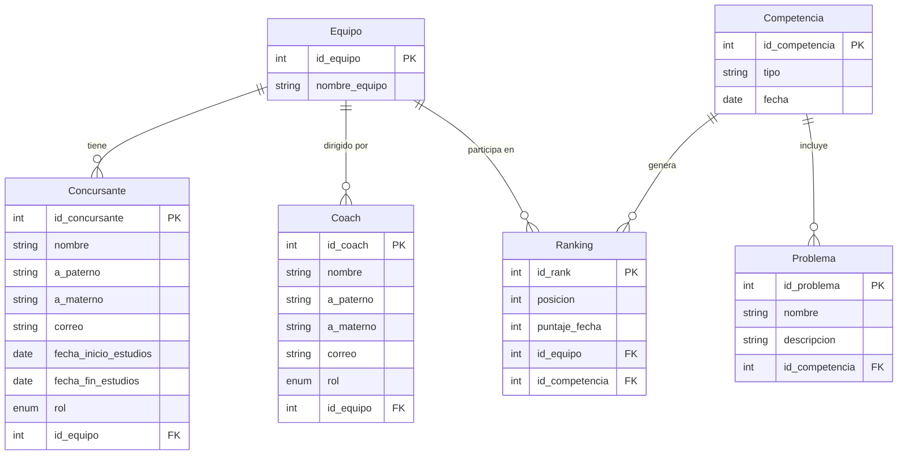

# *Base de Datos Distribuida en Azure - Capa de Software con Python*
_______________________________

📌 **Objetivo.** Implementar una base de datos distribuida en la nube utilizando **Azure Database for MySQL** y desarrollar una capa de software en **Python** con interfaz gráfica que gestione de forma inteligente las operaciones de lectura y escritura, simulando una arquitectura Maestro-Esclavo mediante usuarios con diferentes privilegios.

La información para la *BD* se obtuvo mediante una explicación/plática que se tuvo con el docente simulando un caso real de una consulta para la realización de un *SGBD* donde tomó el rol de un cliente explicando su caso, mientras que nosotros eramos el experto obteniendo información mediante preguntas para poder interpretar lo que él necesita.


Se siguió esta representación para poder realizar todo lo pertinente para la práctica, adaptándola a una arquitectura distribuida en la nube.

_______________________________

# *Modelo Entidad-Relación (MER)*

Una vez analizado e interpretados los *datos*, procedemos a listar los datos para poder realizar un *modelo ER*.



_______________________________
|
# *Configuración de Azure Database for MySQL*

1. Creación de la cuenta y el servidor

Para este proyecto se utilizó Azure Database for MySQL Flexible Server por su facilidad de configuración y su capa gratuita.
    
 Pasos realizados:

-Se creó una cuenta en portal.azure.com con tarjeta de débito para verificación (sin costo inicial).

-En el buscador se escribió: Azure Database for MySQL flexible servers

-Se seleccionó "Creación rápida" (Quick Create) para simplificar el proceso

-Se configuraron los siguientes parámetros:

| Parámetro | Valor asignado |
| --------- | --------- |
| Subscripcción | Azure subscription 1 |
| Grupo de recursos | icpc-mexico2 |
| Nombre del servidor | icpc_mexico |
| Región | West US 2 |
| Versión de MySQL | 8.0 |
| Tipo de carga de trabajo | Desarrollo/Prueba |
| Tamaño de proceso | Burstable B1ms (1 vCore, 2GB RAM) |
| Almacenamiento | 20GB |
| Usuario administrador | islas_vlad |
| Contraseña | ******************* |

-En la pestaña "Networking", se marcó la opción:

      ☑ Agregar regla de firewall para la dirección IP actual
      
-Se hizo clic en "Revisar y crear" y luego en "Crear".

-Se esperó aproximadamente 5-10 minutos hasta que el despliegue finalizó.


2. Obtención de los datos de conexión
   Una vez creado el servidor, se obtuvieron los siguientes datos desde la sección "Overview":

| Dato | Valor |
| --------- | --------- |
| Nombre del servidor | icpc-mexico.mysql.database.azure.com |
| Puerto | 3306 |
| Usuario administrador | islas_vlad |

_______________________________

# *Conexión al servidor desde Azure Query Editor/WorkBench*

 *Opción A: Query Editor (recomendado para empezar)*

  En el menú izquierdo de tu servidor, busca y selecciona "Query editor" (Editor de consultas) 

  Inicia sesión con:
 
      Usuario: islas_vlad

      Contraseña: (la que creaste)

  Una vez dentro, puedes escribir y ejecutar comandos SQL directamente

*Opción B: MySQL Workbench (desde tu computadora)*

  Si prefieres usar MySQL Workbench:

  Abre MySQL Workbench

  Crea una nueva conexión con:

    Hostname: icpc-mexico.mysql.database.azure.com

    Port: 3306

    Username: islas_vlad

    Password: (tu contraseña) 


_______________________________

# *Creación de la base de datos*

1. Una vez dentro, procedemos a crear nuestra *base de datos*.
   ```sql
   mysql> CREATE DATABASE icpc_mexico;
   ```
   
3. Usamos la *base de datos* ya creada.
   ```sql
   mysql> USE icpc_mexico;
   ```

4. Ya en la *base de datos*, ingresamos las sentencias *SQL* para crear las tablas.
   ```sql
       mysql>
             CREATE TABLE Equipo (
             id_equipo      INT NOT NULL AUTO_INCREMENT,
             nombre_equipo  VARCHAR(100) NOT NULL,
             PRIMARY KEY (id_equipo)
             );


             CREATE TABLE Coach (
             id_coach       INT NOT NULL AUTO_INCREMENT,
             nombre         VARCHAR(100) NOT NULL,
             a_paterno      VARCHAR(100) NOT NULL,
             a_materno      VARCHAR(100) NULL,
             correo         VARCHAR(100) NOT NULL,
             id_equipo      INT NOT NULL,
             rol            ENUM('coach', 'cocoach') DEFAULT 'cocoach',
             PRIMARY KEY (id_coach),
             FOREIGN KEY (id_equipo) REFERENCES Equipo(id_equipo)
             );


             CREATE TABLE Concursante (
             id_concursante         INT NOT NULL AUTO_INCREMENT,
             nombre                 VARCHAR(100) NOT NULL,
             a_paterno              VARCHAR(100) NOT NULL,
             a_materno              VARCHAR(100) NULL,
             correo                 VARCHAR(100) NOT NULL,
             fecha_inicio_estudios  DATE NOT NULL,
             fecha_fin_estudios     DATE NOT NULL,
             id_equipo              INT NOT NULL,
             rol                    ENUM('titular', 'suplente') DEFAULT 'titular',
             PRIMARY KEY (id_concursante),
             FOREIGN KEY (id_equipo) REFERENCES Equipo(id_equipo)
             );


             CREATE TABLE Competencia (
             id_competencia  INT NOT NULL AUTO_INCREMENT,
             tipo            VARCHAR(50) NOT NULL,
             fecha           DATE NOT NULL,
             PRIMARY KEY (id_competencia)
             );


             CREATE TABLE Problema (
             id_problema     INT NOT NULL AUTO_INCREMENT,
             nombre          VARCHAR(100),
             descripcion     TEXT NOT NULL,
             id_competencia  INT NOT NULL,
             PRIMARY KEY (id_problema),
             FOREIGN KEY (id_competencia) REFERENCES Competencia(id_competencia)
             );


            CREATE TABLE Ranking (
            id_rank         INT NOT NULL AUTO_INCREMENT,
            posicion        INT NOT NULL,
            puntaje_fecha   INT NOT NULL,
            id_equipo       INT NOT NULL,
            id_competencia  INT NOT NULL,
             PRIMARY KEY (id_rank),
            FOREIGN KEY (id_equipo) REFERENCES Equipo(id_equipo),
            FOREIGN KEY (id_competencia) REFERENCES Competencia(id_competencia)
            );

   ```

5. Con las tablas ya en nuestra *base de datos*, podemos proceder a poblarla.
   ```sql
       mysql>
              INSERT INTO Equipo (nombre_equipo) VALUES ('Prófugos del Citis'), ('Guerreros Digitales');

                INSERT INTO Coach (nombre, a_paterno, a_materno, correo, id_equipo, rol) VALUES
                ('Ana', 'García', 'López', 'ana@mail.com', 1, 'head'),
                ('Carlos', 'Ramírez', NULL, 'carlos@mail.com', 1, 'assistant'),
                ('Luis', 'Fernández', 'Mendoza', 'luis@mail.com', 2, 'head');

   INSERT INTO Concursante (nombre, a_paterno, a_materno, correo, fecha_inicio_estudios, fecha_fin_estudios, id_equipo, rol) VALUES
                ('Juan', 'Pérez', 'Gómez', 'juan@mail.com', '2023-01-15', '2024-12-15', 1, 'titular'),
                ('María', 'López', 'Ruiz', 'maria@mail.com', '2023-01-15', '2024-12-15', 1, 'titular'),
                ('Pedro', 'Sánchez', NULL, 'pedro@mail.com', '2023-06-01', '2025-06-01', 1, 'suplente'),
                ('Laura', 'Martínez', 'Flores', 'laura@mail.com', '2023-02-10', '2024-11-30', 2, 'titular');

               INSERT INTO Competencia (tipo, fecha) VALUES
                ('Repechaje', '2024-03-10'),
                ('Fecha 0', '2024-04-15');

               INSERT INTO Problema (nombre, descripcion, id_competencia) VALUES
                ('A', 'Ordenamiento de burbuja', 1),
                ('B', 'Árbol binario', 1);

               INSERT INTO Ranking (posicion, puntaje_fecha, id_equipo, id_competencia) VALUES
                (1, 100, 1, 1),
                (2, 85, 2, 1);
   
   ```


_______________________________

# *Configuración de Usuarios y Permisos*


Para simular una arquitectura distribuida con Maestro (escrituras) y Esclavo (solo lectura), se crearon dos usuarios con diferentes privilegios dentro del mismo servidor de Azure.

*1. Usuario existente (Maestro)*
El usuario islas_vlad creado al configurar el servidor ya tiene todos los permisos sobre todas las bases de datos.

*2. Creación del usuario Esclavo (solo lectura)*
Desde el Query Editor de Azure o MySQL Workbench, se ejecutaron los siguientes comandos:

   ```sql
        mysql>
            -- Crear el usuario de solo lectura
            CREATE USER 'lectura'@'%' IDENTIFIED BY 'ContraseñaSegura123';

            -- Otorgar solo permiso de SELECT sobre la base de datos
            GRANT SELECT ON competencias_db.* TO 'lectura'@'%';

            -- Aplicar los cambios de privilegios
            FLUSH PRIVILEGES;
   
   ```

*3. Verificación de permisos*
Para comprobar que el usuario lectura solo puede leer, se realizaron las siguientes pruebas:

```sql
        mysql>
            -- Conectar como usuario 'lectura'

            -- Esto funciona (SELECT permitido)
            SELECT * FROM Equipo;

            -- Esto da ERROR (INSERT denegado)
            INSERT INTO Equipo (nombre_equipo) VALUES ('Equipo Prueba');

            -- Esto da ERROR (UPDATE denegado)
            UPDATE Equipo SET nombre_equipo = 'Nuevo Nombre' WHERE id_equipo = 1;

            -- Esto da ERROR (DELETE denegado)
            DELETE FROM Equipo WHERE id_equipo = 1;
   
   ```

*4. Configuración del firewall para múltiples computadoras
Para permitir que otros dispositivos se conecten al servidor de Azure, se agregaron sus direcciones IP en la sección "Networking" del servidor:

    En el portal de Azure → Servidor icpc-mexico → Networking

    En "Firewall rules" → "+ Add firewall rule"

Se agregó:

    Rule name: laptop-compañero

    Start IP: IP pública de la otra computadora

    End IP: misma IP

Se hizo clic en "Save"


_______________________________

# *Capa de Software*

Se desarrolló una capa de software en Python con interfaz gráfica utilizando Tkinter (incluido por defecto en Python). Esta capa se encarga de enrutar las operaciones según su tipo: escrituras al usuario MASTER y lecturas al usuario SLAVE.

*Instalación de dependencias

    pip install mysql-connector-python


*Archivo config.py

Este archivo contiene los datos de conexión a Azure para ambos usuarios.

```py
        python>
# config.py - Configuración para Azure

CONFIG = {
    # Usuario MASTER (todos los permisos)
    'MASTER': {
        'host': 'icpc-mexico.mysql.database.azure.com',
        'user': 'islas_vlad',
        'password': 'TU_CONTRASEÑA_MAESTRO',
        'database': 'competencias_db'
    },
    # Usuario SLAVE (solo lectura)
    'SLAVE': {
        'host': 'icpc-mexico.mysql.database.azure.com',
        'user': 'lectura',
        'password': 'TU_CONTRASEÑA_LECTURA',
        'database': 'competencias_db'
    }
}
 
   ```

