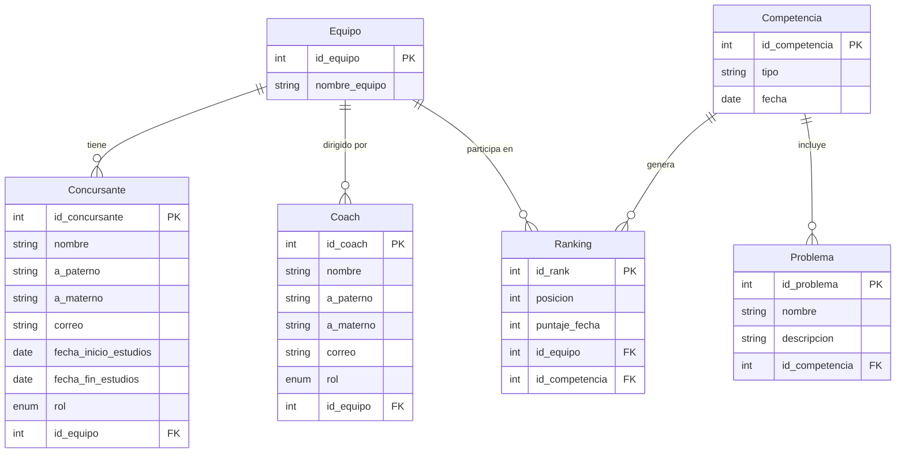

# *Base de Datos Distribuida en Azure - Capa de Software con Python*
_______________________________

📌 **Objetivo.** Implementar una base de datos distribuida en la nube utilizando **Azure Database for MySQL** y desarrollar una capa de software en **Python** con interfaz gráfica que gestione de forma inteligente las operaciones de lectura y escritura, simulando una arquitectura Maestro-Esclavo mediante usuarios con diferentes privilegios.

La información para la *BD* se obtuvo mediante una explicación/plática que se tuvo con el docente simulando un caso real de una consulta para la realización de un *SGBD* donde tomó el rol de un cliente explicando su caso, mientras que nosotros eramos el experto obteniendo información mediante preguntas para poder interpretar lo que él necesita.

Se siguió esta representación para poder realizar todo lo pertinente para la práctica, adaptándola a una arquitectura distribuida en la nube.

_______________________________

# *Modelo Entidad-Relación (MER)*

Una vez analizado e interpretados los *datos*, procedemos a listar los datos para poder realizar un *modelo ER*.

_______________________________

# *Configuración de Azure Database for MySQL*
1. Creación de la cuenta y el servidor

Para este proyecto se utilizó Azure Database for MySQL Flexible Server por su facilidad de configuración y su capa gratuita.
    
 Pasos realizados:
    -Se creó una cuenta en portal.azure.com con tarjeta de débito para verificación (sin costo inicial).
    -En el buscador se escribió: Azure Database for MySQL flexible servers
    -Se seleccionó "Creación rápida" (Quick Create) para simplificar el proceso.
    -Se configuraron los siguientes parámetros:

| Parámetro | Valor asignado |
| --------- | --------- |
| Subscripcción | Azure subscription 1 |
| Grupo de recursos | icpc-mexico2 |
| Nombre del servidor | icpc_mexico |
| Región | West US 2 |
| Versión de MySQL | 8.0 |
| Tipo de carga de trabajo | Desarrollo/Prueba |
| Tamaño de proceso | Burstable B1ms (1 vCore, 2GB RAM) |
| Almacenamiento | 20GB |
| Usuario administrador | islas_vlad |
| Contraseña | ******************* |

   -En la pestaña "Networking", se marcó la opción:
      ☑ Agregar regla de firewall para la dirección IP actual
   -Se hizo clic en "Revisar y crear" y luego en "Crear".
   -Se esperó aproximadamente 5-10 minutos hasta que el despliegue finalizó.

