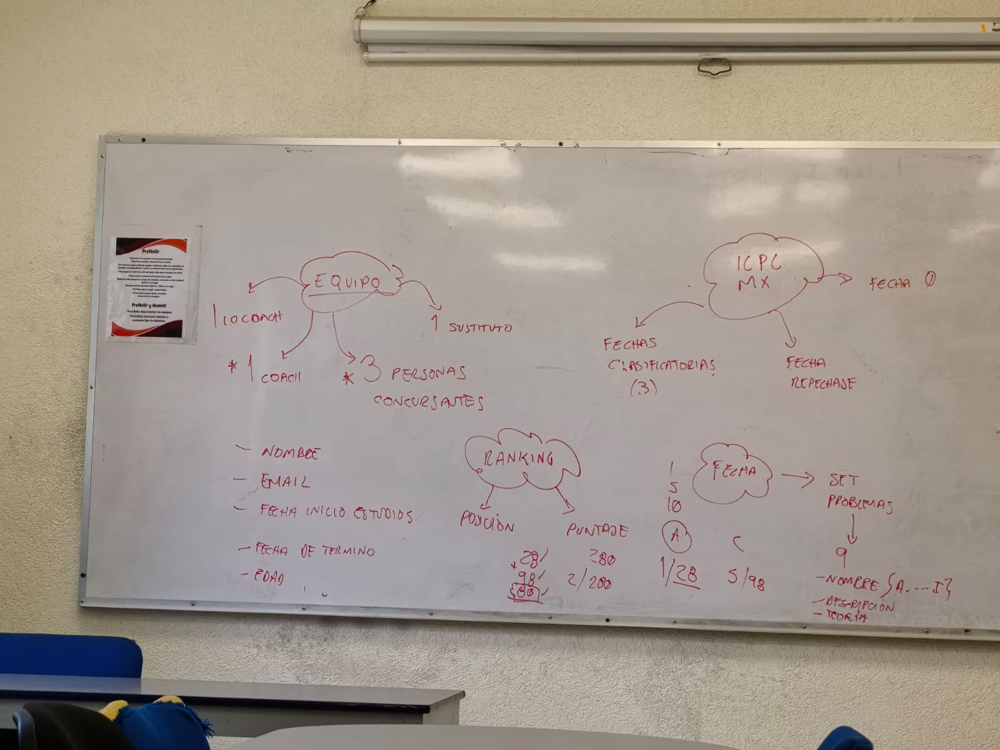

## *Replicación de BD*
_______________________________

📌 Replicación de una base de datos en MySQL 8.0

**Instruccion**. Para este ejercicio se realizo una creación de una base de datos, de la cual se realizo este ejercicio.
Se obtuvo informacion del [*Sitio Oficial de MySQL*](https://dev.mysql.com/doc/refman/8.0/en/replication-configuration.html) 
para la construción de la replicación.

La informacion para la *BD* se obtuvo mediante una explicación/platica que se tuvo con
el docente simulando un caso real de una consulta para la realización de un *SGDB* dondetomó el rol de un cliente explicando su caso, mientras que nosotros eramos el experto obteniendo información mediante preguntaspara poder interpretar lo que el cliente necesita.

Se siguió esta t
